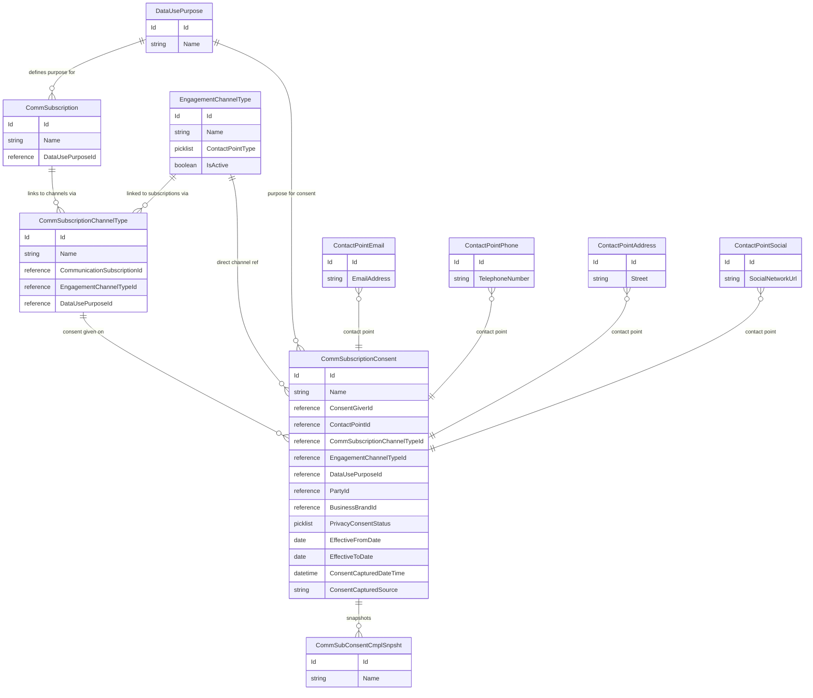
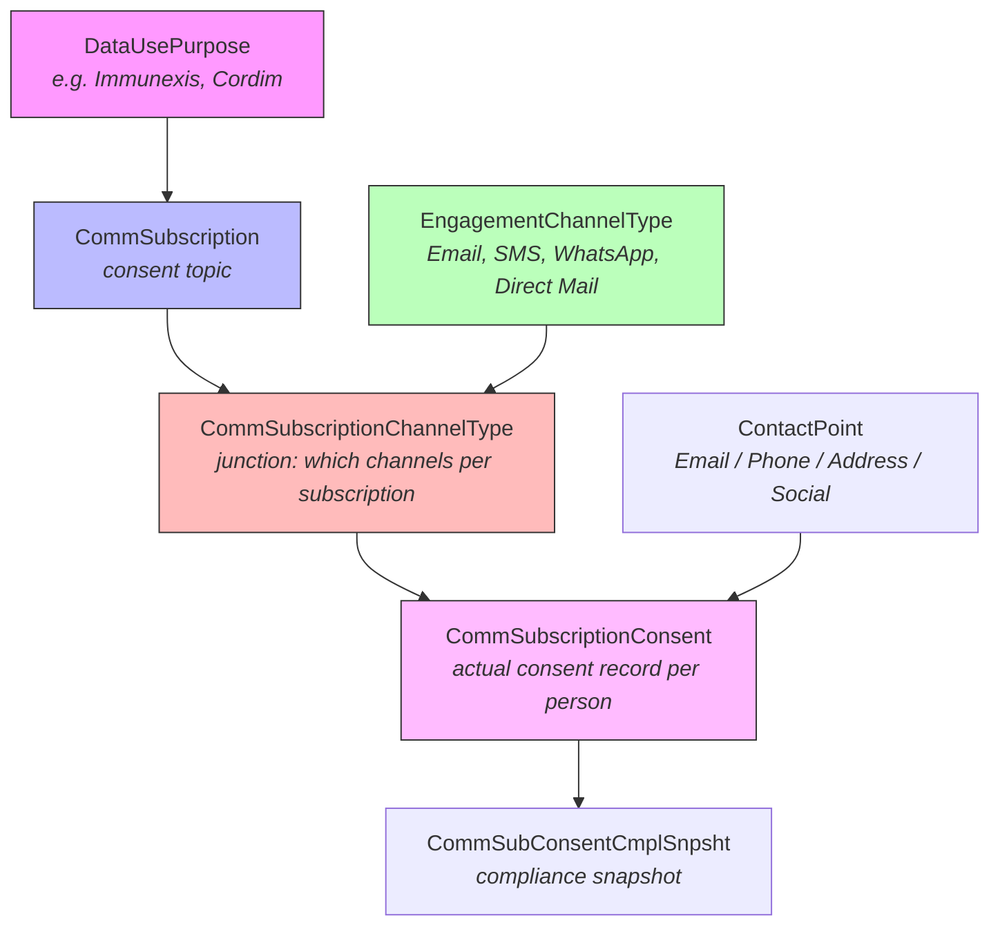

# How to Set Up Consent Management in Life Sciences Cloud

**Org:** *(your connected LSC org)*

---

## Current State (Example Org)

### Engagement Channel Types (the channels available for consent)

| Name | ContactPointType | Active |
|------|-----------------|--------|
| Direct Mail | MailingAddress | Yes |
| Email | Email | Yes |
| Mobile - SMS | Phone | Yes |
| WhatsApp | Social | Yes |

### Communication Subscriptions (consent topics / purposes)

| Subscription | Linked DataUsePurpose |
|-------------|----------------------|
| Immunexis | Immunexis |
| Cordim | Cordim |
| Rheumatology Clinical Research | Rheumatology Clinical Research |

### Channel-to-Subscription Mapping (CommSubscriptionChannelType)

Every subscription is linked to all 4 channels:

| Subscription | Direct Mail | Email | Mobile - SMS | WhatsApp |
|-------------|:-----------:|:-----:|:------------:|:--------:|
| Immunexis | X | X | X | X |
| Cordim | X | X | X | X |
| Rheumatology Clinical Research | X | X | X | X |

### Existing Consent Records (CommSubscriptionConsent)

10 consent records exist, mostly on Email and Direct Mail channels with `OptIn`/`OptOut` statuses.

---

## Data Model — Mermaid Diagram



### Relationship Flow (simplified)



---

## How to Remove a Channel by Country

The goal: Users in **Country A** should see WhatsApp as a channel option, but users in **Country B** should not.

### The Problem

The standard consent objects (`EngagementChannelType`, `CommSubscriptionChannelType`) are **global** — there is no built-in `Country__c` field on any of them. The `EngagementChannelType` object has these fields:

| Field | Type |
|-------|------|
| Id | id |
| OwnerId | reference |
| Name | string |
| ContactPointType | picklist |
| IsActive | boolean |
| UsageType | multipicklist |

**No country, region, or territory field exists out of the box.**

### Solution: Sharing Rules by Country

Since `EngagementChannelType` has an **OwnerId** field and a corresponding **EngagementChannelTypeShare** object, it supports sharing rules. Here's how to restrict channels by country:

#### Step 1: Set the Org-Wide Default (OWD) to Private

1. Go to **Setup > Sharing Settings**
2. Set `EngagementChannelType` OWD to **Private**
3. This makes channels invisible by default — users only see what's explicitly shared

#### Step 2: Add a Country__c Field to EngagementChannelType

You **do** need to add a custom field to create criteria-based sharing rules:

```
Object:  EngagementChannelType
Field:   Country__c
Type:    Picklist (or Text)
Values:  US, UK, DE, FR, JP, ... (your country codes)
```

> **Important:** A single `EngagementChannelType` record (e.g., "WhatsApp") is shared across all subscriptions. If you need WhatsApp visible in the US but not in Germany, you have two approaches:

#### Approach A: One Channel Record Per Country (Recommended for Sharing Rules)

Create country-specific channel records:

| Name | ContactPointType | Country__c |
|------|-----------------|------------|
| WhatsApp - US | Social | US |
| WhatsApp - DE | Social | DE |
| Email | Email | ALL |
| Direct Mail | MailingAddress | ALL |

Then create sharing rules:
- **Rule 1:** Share `EngagementChannelType` where `Country__c = US` with the **US Users** public group
- **Rule 2:** Share `EngagementChannelType` where `Country__c = DE` with the **DE Users** public group

#### Approach B: Single Record + Manual Share (Less Scalable)

Keep one "WhatsApp" record but use Apex to create `EngagementChannelTypeShare` records programmatically:

```apex
EngagementChannelTypeShare share = new EngagementChannelTypeShare();
share.ParentId = whatsAppChannelId;       // The WhatsApp EngagementChannelType ID
share.UserOrGroupId = usPublicGroupId;    // The US public group
share.AccessLevel = 'Read';
share.RowCause = Schema.EngagementChannelTypeShare.RowCause.Manual;
insert share;
```

### Step 3: Set Up Public Groups by Country

1. **Setup > Public Groups**
2. Create groups: `US_Users`, `DE_Users`, `UK_Users`, etc.
3. Add users to the appropriate country group

### Step 4: Create Sharing Rules

1. **Setup > Sharing Settings > EngagementChannelType Sharing Rules**
2. Create criteria-based sharing rules:

| Rule Name | Criteria | Share With | Access |
|-----------|----------|-----------|--------|
| US Channels | Country__c = US | US_Users | Read Only |
| DE Channels | Country__c = DE | DE_Users | Read Only |
| Global Channels | Country__c = ALL | All Internal Users | Read Only |

---

## How to Add a New Channel (e.g., WhatsApp)

WhatsApp already exists in this org! But here's the general process for adding any new channel:

### Step 1: Create the EngagementChannelType Record

```apex
EngagementChannelType ect = new EngagementChannelType();
ect.Name = 'WhatsApp';
ect.ContactPointType = 'Social';  // Social for messaging apps
ect.IsActive = true;
insert ect;
```

**ContactPointType picklist values and their matching Contact Point objects:**

| ContactPointType | Contact Point Object |
|-----------------|---------------------|
| Email | ContactPointEmail |
| Phone | ContactPointPhone |
| MailingAddress | ContactPointAddress |
| Social | ContactPointSocial |

### Step 2: Link the Channel to Subscriptions

For each `CommSubscription` that should offer this channel, create a `CommSubscriptionChannelType`:

```apex
// Get the subscription and channel IDs
Id subscriptionId = [SELECT Id FROM CommSubscription WHERE Name = 'Immunexis'].Id;
Id channelId = [SELECT Id FROM EngagementChannelType WHERE Name = 'WhatsApp'].Id;

CommSubscriptionChannelType csct = new CommSubscriptionChannelType();
csct.CommunicationSubscriptionId = subscriptionId;
csct.EngagementChannelTypeId = channelId;
csct.Name = 'Immunexis - WhatsApp';
insert csct;
```

### Step 3: Verify the Mapping

```sql
SELECT CommSubscription.Name, EngagementChannelType.Name
FROM CommSubscriptionChannelType
WHERE EngagementChannelType.Name = 'WhatsApp'
```

---

## How to Remove a Channel from a Specific Subscription

To remove WhatsApp from the "Cordim" subscription but keep it for others:

```apex
// Find and delete the junction record
CommSubscriptionChannelType[] toDelete = [
    SELECT Id FROM CommSubscriptionChannelType
    WHERE CommunicationSubscription.Name = 'Cordim'
    AND EngagementChannelType.Name = 'WhatsApp'
];
delete toDelete;
```

This removes the channel option but does **not** delete any existing consent records.

---

## Summary: What Needs to Happen for Country-Based Channel Visibility

| Step | Action | Where |
|------|--------|-------|
| 1 | Set OWD for EngagementChannelType to **Private** | Setup > Sharing Settings |
| 2 | Add `Country__c` custom field to `EngagementChannelType` | Setup > Object Manager |
| 3 | Create country-specific channel records (or tag existing ones) | Data |
| 4 | Create Public Groups per country | Setup > Public Groups |
| 5 | Create criteria-based Sharing Rules | Setup > Sharing Settings |
| 6 | Assign users to country groups | Setup > Public Groups |

### Key Points

- **EngagementChannelType** supports sharing (has `EngagementChannelTypeShare` object with `OwnerId`)
- **No Country__c field exists** out of the box — you must add one
- The sharing model works because OWD=Private + Sharing Rules = country-specific visibility
- `CommSubscriptionChannelType` (the junction) inherits visibility from its parent objects — if a user can't see the `EngagementChannelType`, they can't see the junction
- `CommSubscriptionConsent` (actual consent records) also has a Share object, so consent records themselves can be restricted too

---

## Troubleshooting: OWD is Private but Users Can See All Channels

### Symptom

You set `EngagementChannelType` OWD to **Private**, but all users can still see every channel (Email, WhatsApp, SMS, Direct Mail, etc.).

### Root Cause: "View All Records" on Profiles or Permission Sets

Even with OWD = Private, the **View All Records** (and **Modify All Records**) object permission **completely bypasses sharing rules**. If a profile or permission set grants View All on `EngagementChannelType`, that user sees every record regardless of OWD, sharing rules, or manual shares.

### How to Diagnose

Run this SOQL query to find every profile and permission set with View All:

```sql
SELECT
    Parent.Label,
    Parent.IsOwnedByProfile,
    Parent.Profile.Name,
    PermissionsViewAllRecords,
    PermissionsModifyAllRecords
FROM ObjectPermissions
WHERE SobjectType = 'EngagementChannelType'
    AND (PermissionsViewAllRecords = true OR PermissionsModifyAllRecords = true)
ORDER BY Parent.Label
```

### What to Look For

Common offenders that ship with View All enabled:

| Profile / Permission Set | Typically Has View All? | Should You Remove It? |
|---|---|---|
| System Administrator | Yes | No — admins need full access |
| **Field Sales Representative** | Yes | **Yes — remove for sharing rules to work** |
| **Key Account Manager** | Yes | **Yes — remove for sharing rules to work** |
| **Custom Life Sciences Commercial User** (PermSet) | Yes | **Yes — remove for sharing rules to work** |
| Cloned Admin | Yes | No — admin clone |
| Analytics Cloud Integration/Security User | Yes | No — system integration profiles |

### How to Fix

You must remove View All from **three related objects** in dependency order. Salesforce enforces dependencies — you cannot remove View All from a parent object while a child object still has it.

**Order of removal (child → parent):**

1. `CommSubscriptionConsent` — remove View All / Modify All
2. `CommSubscriptionChannelType` — remove View All / Modify All
3. `EngagementChannelType` — remove View All / Modify All

**Via Setup UI:**

1. Go to **Setup > Profiles > [Profile Name]**
2. Click **Object Settings** (or use Enhanced Profile UI)
3. For each of the 3 objects above (in order), uncheck **View All** and **Modify All**
4. Save

**Via SOQL + API (programmatic):**

```sql
-- Find the ObjectPermissions record IDs
SELECT Id, ParentId, Parent.Profile.Name, SobjectType,
       PermissionsViewAllRecords, PermissionsModifyAllRecords
FROM ObjectPermissions
WHERE SobjectType IN ('CommSubscriptionConsent',
                      'CommSubscriptionChannelType',
                      'EngagementChannelType')
    AND (PermissionsViewAllRecords = true OR PermissionsModifyAllRecords = true)
    AND Parent.Profile.Name = 'Field Sales Representative'
```

Then update each record:

```bash
sf data update record -s ObjectPermissions -i <RecordId> \
    -v "PermissionsViewAllRecords=false PermissionsModifyAllRecords=false" \
    -o <your-org>
```

### After Fixing

Verify that only admin profiles retain View All:

```sql
SELECT Parent.Profile.Name, Parent.Label, PermissionsViewAllRecords
FROM ObjectPermissions
WHERE SobjectType = 'EngagementChannelType'
    AND PermissionsViewAllRecords = true
ORDER BY Parent.Label
```

Expected result — only system/admin profiles:

| Profile | View All |
|---------|----------|
| System Administrator | True |
| System Administrator Cache Gen | True |
| System Administrator Cloned | True |
| Cloned Admin | True |
| Analytics Cloud Integration User | True |
| Analytics Cloud Security User | True |

Field-facing profiles (Field Sales Representative, Key Account Manager) and their permission sets should **not** appear in this list.

---

## Troubleshooting: Channels Appear but Dropdowns Show "No values available"

### Symptom

The consent screen shows the correct channels (Email, Direct Mail, Mobile - SMS, WhatsApp) but every dropdown says **"No values available"**.

### Root Cause: No Contact Point Records on the Account

The channel dropdowns are **pickers, not editors**. They display existing Contact Point records linked to the account. Each channel type maps to a specific Contact Point object:

| Channel (EngagementChannelType) | ContactPointType | Dropdown Pulls From |
|---|---|---|
| Email | Email | `ContactPointEmail` records on the account |
| Direct Mail | MailingAddress | `ContactPointAddress` records on the account |
| Mobile - SMS | Phone | `ContactPointPhone` records on the account |
| WhatsApp | Social | `ContactPointSocial` records on the account |

If the account has no `ContactPointEmail` records, the Email dropdown will be empty. You **cannot add contact point values from the consent screen** — they must exist first.

### How to Diagnose

Check whether the account has Contact Point records:

```sql
-- Replace the AccountId with the actual account
SELECT Id, EmailAddress, ParentId FROM ContactPointEmail WHERE ParentId = '<AccountId>'
SELECT Id, TelephoneNumber, ParentId FROM ContactPointPhone WHERE ParentId = '<AccountId>'
SELECT Id, Name, ParentId FROM ContactPointAddress WHERE ParentId = '<AccountId>'
```

### How to Fix

Create Contact Point records on the account before capturing consent:

```apex
// Create an email contact point
ContactPointEmail cpe = new ContactPointEmail();
cpe.ParentId = accountId;
cpe.EmailAddress = 'doctor@hospital.com';
cpe.IsPrimary = true;
insert cpe;

// Create a phone contact point
ContactPointPhone cpp = new ContactPointPhone();
cpp.ParentId = accountId;
cpp.TelephoneNumber = '+1-555-0100';
cpp.IsPrimary = true;
insert cpp;

// Create a mailing address contact point
ContactPointAddress cpa = new ContactPointAddress();
cpa.ParentId = accountId;
cpa.Name = 'Office Address';
cpa.Street = '123 Main St';
cpa.City = 'Boston';
cpa.State = 'MA';
cpa.PostalCode = '02101';
cpa.Country = 'US';
insert cpa;
```

### Important Notes

- Contact Points are linked to the **Account** (via `ParentId`), not to the Contact or Individual
- The consent screen reads Contact Points from the account selected in the "Account" field at the top of the consent form
- If sharing is Private on Contact Point objects, ensure the user has access to the Contact Point records too
- After creating Contact Points, the user must re-sync the mobile device for the values to appear

### Sharing Checklist for a Working Consent Screen

All of these objects must be accessible to the user for the full consent flow to work:

| Object | Purpose | Required Access |
|---|---|---|
| `CommSubscription` | Consent topics | Read |
| `EngagementChannelType` | Available channels | Read |
| `CommSubscriptionChannelType` | Which channels per subscription | Read |
| `ContactPointEmail` | Email addresses for Email channel | Read |
| `ContactPointPhone` | Phone numbers for SMS channel | Read |
| `ContactPointAddress` | Addresses for Direct Mail channel | Read |
| `ContactPointSocial` | Social handles for WhatsApp channel | Read |
| `CommSubscriptionConsent` | Actual consent records | Read/Write |

---

## Troubleshooting: Accept Button is Greyed Out After Signing

### Symptom

You've selected channels, checked the acknowledgement box, and signed — but the **Accept** button remains greyed out.

### Root Cause: The Lock Icon

The consent screen has a **lock icon** (next to Accept) as a safeguard against accidental submissions. This is by design.

### How to Fix

1. Tap the **lock icon** to unlock the form
2. The **Accept** button becomes active
3. Tap **Accept** to submit the consent

---

## How to Remove a Channel for a Specific User (via Sharing)

To hide a channel (e.g., WhatsApp) from a specific user while keeping it visible to others, remove their share records on **two objects**:

### Objects to Unshare

| Object | What to Remove | Why |
|---|---|---|
| `EngagementChannelTypeShare` | The share for the WhatsApp channel record | Hides the channel from the user's picker |
| `CommSubscriptionChannelTypeShare` | The shares for every subscription-to-WhatsApp junction | Prevents the junction records from syncing to the device |

### Steps

**1. Find the EngagementChannelType share:**

```sql
SELECT Id, Parent.Name
FROM EngagementChannelTypeShare
WHERE UserOrGroupId = '<UserId>'
    AND Parent.Name = 'WhatsApp'
```

**2. Find the CommSubscriptionChannelType shares:**

```sql
SELECT Id, Parent.Name
FROM CommSubscriptionChannelTypeShare
WHERE UserOrGroupId = '<UserId>'
    AND Parent.EngagementChannelTypeId = '<WhatsAppChannelId>'
```

**3. Delete all matched share records.**

### Example

For a user with 3 subscriptions (Immunexis, Cordim, Rheumatology Clinical Research), removing WhatsApp requires deleting **4 share records**:

| Share Object | Record Name |
|---|---|
| `CommSubscriptionChannelTypeShare` | Immunexis WhatsApp |
| `CommSubscriptionChannelTypeShare` | Cordim WhatsApp |
| `CommSubscriptionChannelTypeShare` | Rheumatology WhatsApp |
| `EngagementChannelTypeShare` | WhatsApp |

After the user re-syncs, WhatsApp no longer appears on the consent screen. The other channels (Email, Direct Mail, Mobile - SMS) remain unaffected.

---

## Data Change Management (DCM) and Consent Contact Points

### Overview

All four Contact Point objects used by the consent screen can be placed under DCM control:

| Object | DCM Managed Fields |
|---|---|
| `ContactPointAddress` | `Address` (compound), `AddressType` |
| `ContactPointEmail` | *(check your org's configuration)* |
| `ContactPointPhone` | *(check your org's configuration)* |
| `ContactPointSocial` | *(check your org's configuration)* |

When a DCM persona definition is set to `DoNotApplyChangesImmediately` for a profile (e.g., Field Sales Representative), changes to managed fields create a **Data Change Request (DCR)** instead of updating the record directly. An admin must approve the DCR before the change takes effect.

### Known Limitation: Compound vs Individual Address Fields

DCM for `ContactPointAddress` can only manage the **compound `Address` field** — you cannot add individual address components (`Street`, `City`, `State`, `PostalCode`, `Country`) as separate managed fields. Attempting to do so will result in an error.

**The gap:** If a field rep updates individual address fields (e.g., changes just `Street` or `City`) rather than the compound `Address` field, **DCM will not intercept the change**. The update goes through immediately with no DCR created.

This means:
- Updates via the compound `Address` field → DCR created, requires approval
- Updates to `Street`, `City`, `Country`, etc. individually → **applied immediately, no DCR**

### How to Diagnose Missing DCRs

If you expect a DCR but don't see one:

**1. Check which fields are managed:**

```sql
SELECT FieldApiName, ShouldApplyChngImmediately
FROM LifeSciDataChgDefMngFld
WHERE LifeSciDataChgDefId = '<ContactPointAddress DCM Def Id>'
```

**2. Check if the user's profile has a persona definition:**

```sql
SELECT ProfileId, ChangeUpdateType, IsActive
FROM LifeSciDataChgPersonaDef
WHERE IsActive = true
```

Only profiles listed here with `DoNotApplyChangesImmediately` will trigger DCRs.

**3. Check if the record was updated directly (no DCR):**

```sql
SELECT Id, Name, Street, City, LastModifiedDate, LastModifiedBy.Name
FROM ContactPointAddress
WHERE Id = '<RecordId>'
```

If `LastModifiedBy` is the field rep and no corresponding DCR exists, the change bypassed DCM because it was made to a non-managed field.

### Impact on Consent

- Contact Point values shown in the consent screen dropdowns reflect the **current record state**
- If a field rep changes an address and it bypasses DCM, that new address appears in the consent dropdown immediately on next sync
- If the change goes through DCM, the old address remains in the dropdown until the DCR is approved
