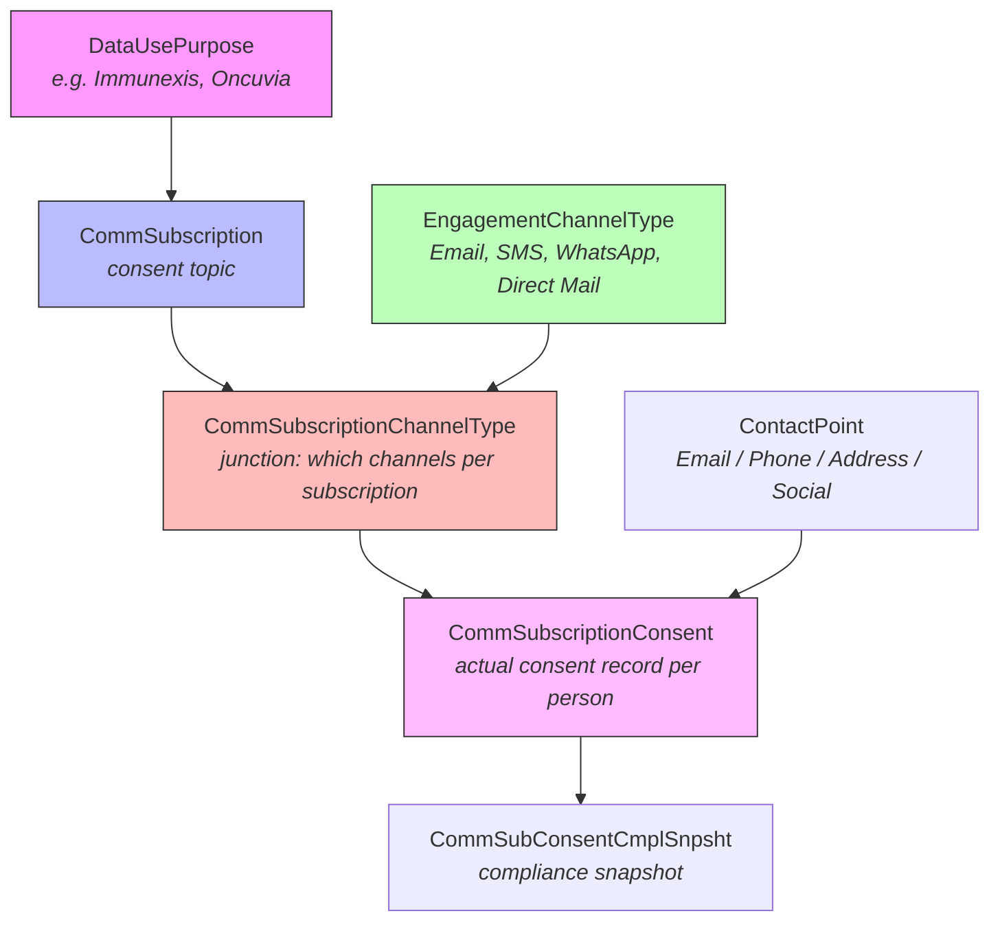

# How to Set Up Consent Management in Life Sciences Cloud

**Org:** *(your connected LSC org)*

---

## Current State (260-pm Org)

### Engagement Channel Types (the channels available for consent)

| Name | ContactPointType | Active |
|------|-----------------|--------|
| Direct Mail | MailingAddress | Yes |
| Email | Email | Yes |
| Mobile - SMS | Phone | Yes |
| WhatsApp | Social | Yes |

### Communication Subscriptions (consent topics / purposes)

| Subscription | Linked DataUsePurpose |
|-------------|----------------------|
| Immunexis | Immunexis |
| Oncuvia | Oncuvia |
| Rheumatology Clinical Research | Rheumatology Clinical Research |

### Channel-to-Subscription Mapping (CommSubscriptionChannelType)

Every subscription is linked to all 4 channels:

| Subscription | Direct Mail | Email | Mobile - SMS | WhatsApp |
|-------------|:-----------:|:-----:|:------------:|:--------:|
| Immunexis | X | X | X | X |
| Oncuvia | X | X | X | X |
| Rheumatology Clinical Research | X | X | X | X |

### Existing Consent Records (CommSubscriptionConsent)

10 consent records exist, mostly on Email and Direct Mail channels with `OptIn`/`OptOut` statuses.

---

## Data Model — Mermaid Diagram


### Relationship Flow (simplified)



---

## How to Remove a Channel by Country

The goal: Users in **Country A** should see WhatsApp as a channel option, but users in **Country B** should not.

### The Problem

The standard consent objects (`EngagementChannelType`, `CommSubscriptionChannelType`) are **global** — there is no built-in `Country__c` field on any of them. The `EngagementChannelType` object has these fields:

| Field | Type |
|-------|------|
| Id | id |
| OwnerId | reference |
| Name | string |
| ContactPointType | picklist |
| IsActive | boolean |
| UsageType | multipicklist |

**No country, region, or territory field exists out of the box.**

### Solution: Sharing Rules by Country

Since `EngagementChannelType` has an **OwnerId** field and a corresponding **EngagementChannelTypeShare** object, it supports sharing rules. Here's how to restrict channels by country:

#### Step 1: Set the Org-Wide Default (OWD) to Private

1. Go to **Setup > Sharing Settings**
2. Set `EngagementChannelType` OWD to **Private**
3. This makes channels invisible by default — users only see what's explicitly shared

#### Step 2: Add a Country__c Field to EngagementChannelType

You **do** need to add a custom field to create criteria-based sharing rules:

```
Object:  EngagementChannelType
Field:   Country__c
Type:    Picklist (or Text)
Values:  US, UK, DE, FR, JP, ... (your country codes)
```

> **Important:** A single `EngagementChannelType` record (e.g., "WhatsApp") is shared across all subscriptions. If you need WhatsApp visible in the US but not in Germany, you have two approaches:

#### Approach A: One Channel Record Per Country (Recommended for Sharing Rules)

Create country-specific channel records:

| Name | ContactPointType | Country__c |
|------|-----------------|------------|
| WhatsApp - US | Social | US |
| WhatsApp - DE | Social | DE |
| Email | Email | ALL |
| Direct Mail | MailingAddress | ALL |

Then create sharing rules:
- **Rule 1:** Share `EngagementChannelType` where `Country__c = US` with the **US Users** public group
- **Rule 2:** Share `EngagementChannelType` where `Country__c = DE` with the **DE Users** public group

#### Approach B: Single Record + Manual Share (Less Scalable)

Keep one "WhatsApp" record but use Apex to create `EngagementChannelTypeShare` records programmatically:

```apex
EngagementChannelTypeShare share = new EngagementChannelTypeShare();
share.ParentId = whatsAppChannelId;       // The WhatsApp EngagementChannelType ID
share.UserOrGroupId = usPublicGroupId;    // The US public group
share.AccessLevel = 'Read';
share.RowCause = Schema.EngagementChannelTypeShare.RowCause.Manual;
insert share;
```

### Step 3: Set Up Public Groups by Country

1. **Setup > Public Groups**
2. Create groups: `US_Users`, `DE_Users`, `UK_Users`, etc.
3. Add users to the appropriate country group

### Step 4: Create Sharing Rules

1. **Setup > Sharing Settings > EngagementChannelType Sharing Rules**
2. Create criteria-based sharing rules:

| Rule Name | Criteria | Share With | Access |
|-----------|----------|-----------|--------|
| US Channels | Country__c = US | US_Users | Read Only |
| DE Channels | Country__c = DE | DE_Users | Read Only |
| Global Channels | Country__c = ALL | All Internal Users | Read Only |

---

## How to Add a New Channel (e.g., WhatsApp)

WhatsApp already exists in this org! But here's the general process for adding any new channel:

### Step 1: Create the EngagementChannelType Record

```apex
EngagementChannelType ect = new EngagementChannelType();
ect.Name = 'WhatsApp';
ect.ContactPointType = 'Social';  // Social for messaging apps
ect.IsActive = true;
insert ect;
```

**ContactPointType picklist values and their matching Contact Point objects:**

| ContactPointType | Contact Point Object |
|-----------------|---------------------|
| Email | ContactPointEmail |
| Phone | ContactPointPhone |
| MailingAddress | ContactPointAddress |
| Social | ContactPointSocial |

### Step 2: Link the Channel to Subscriptions

For each `CommSubscription` that should offer this channel, create a `CommSubscriptionChannelType`:

```apex
// Get the subscription and channel IDs
Id subscriptionId = [SELECT Id FROM CommSubscription WHERE Name = 'Immunexis'].Id;
Id channelId = [SELECT Id FROM EngagementChannelType WHERE Name = 'WhatsApp'].Id;

CommSubscriptionChannelType csct = new CommSubscriptionChannelType();
csct.CommunicationSubscriptionId = subscriptionId;
csct.EngagementChannelTypeId = channelId;
csct.Name = 'Immunexis - WhatsApp';
insert csct;
```

### Step 3: Verify the Mapping

```sql
SELECT CommSubscription.Name, EngagementChannelType.Name
FROM CommSubscriptionChannelType
WHERE EngagementChannelType.Name = 'WhatsApp'
```

---

## How to Remove a Channel from a Specific Subscription

To remove WhatsApp from the "Oncuvia" subscription but keep it for others:

```apex
// Find and delete the junction record
CommSubscriptionChannelType[] toDelete = [
    SELECT Id FROM CommSubscriptionChannelType
    WHERE CommunicationSubscription.Name = 'Oncuvia'
    AND EngagementChannelType.Name = 'WhatsApp'
];
delete toDelete;
```

This removes the channel option but does **not** delete any existing consent records.

---

## Summary: What Needs to Happen for Country-Based Channel Visibility

| Step | Action | Where |
|------|--------|-------|
| 1 | Set OWD for EngagementChannelType to **Private** | Setup > Sharing Settings |
| 2 | Add `Country__c` custom field to `EngagementChannelType` | Setup > Object Manager |
| 3 | Create country-specific channel records (or tag existing ones) | Data |
| 4 | Create Public Groups per country | Setup > Public Groups |
| 5 | Create criteria-based Sharing Rules | Setup > Sharing Settings |
| 6 | Assign users to country groups | Setup > Public Groups |

### Key Points

- **EngagementChannelType** supports sharing (has `EngagementChannelTypeShare` object with `OwnerId`)
- **No Country__c field exists** out of the box — you must add one
- The sharing model works because OWD=Private + Sharing Rules = country-specific visibility
- `CommSubscriptionChannelType` (the junction) inherits visibility from its parent objects — if a user can't see the `EngagementChannelType`, they can't see the junction
- `CommSubscriptionConsent` (actual consent records) also has a Share object, so consent records themselves can be restricted too
